# ChurnAlert AI

ChurnAlert AI is a full-stack agentic system that helps Customer Success Managers (CSMs) in SaaS companies identify customers who are about to cancel and take action to retain them. Every morning the system automatically checks all customer accounts, scores each one for churn risk, and for high-risk accounts the AI writes a personalized outreach message ready for the CSM to approve and send. The system also tracks whether each intervention worked and learns from the results over time.

---

## Screenshots

<details>
<summary>🖥️ Click to expand — All Screenshots</summary>

### Landing Page
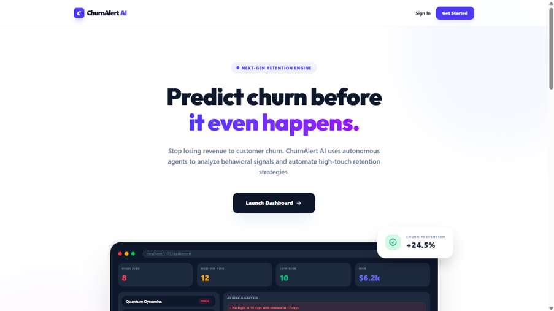

### Login Page — Role Selector
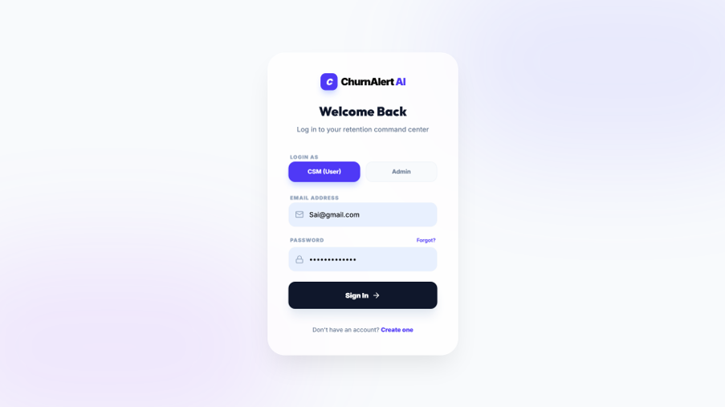

### CSM Dashboard — HubSpot Live Data
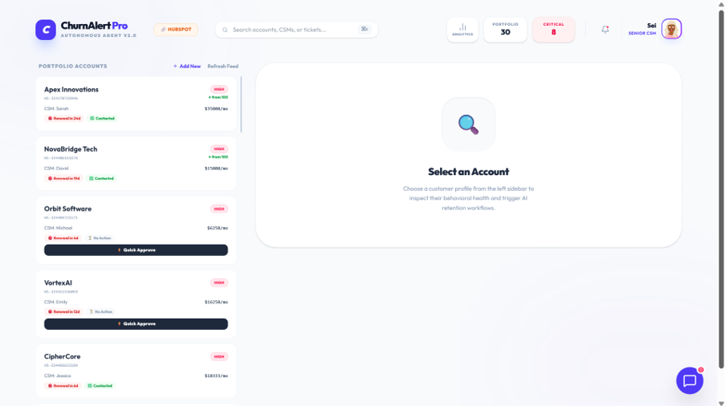

### Account Detail — Risk Factor Breakdown
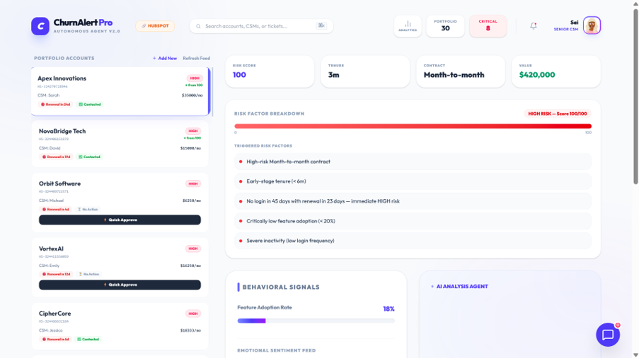

### AI Analysis — Bullet Points, Confidence, Outreach Draft
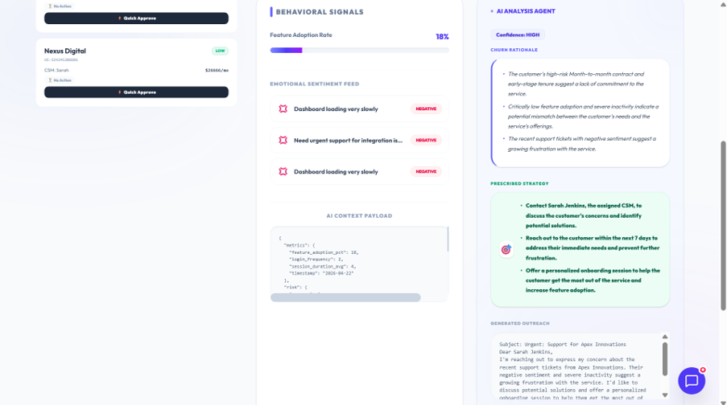

### Node 6 — Mark as Renewed / Churned
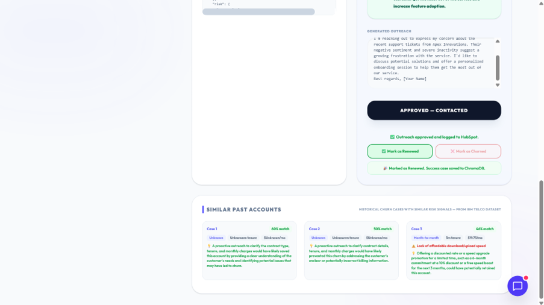

### Chatbot — Suggested Questions
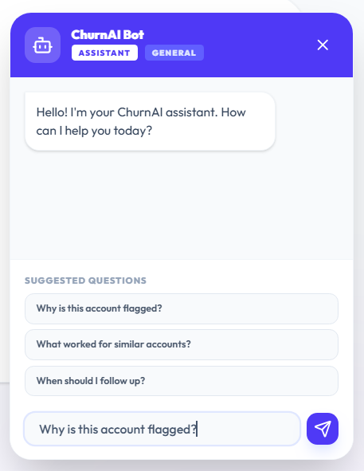

### Notification System
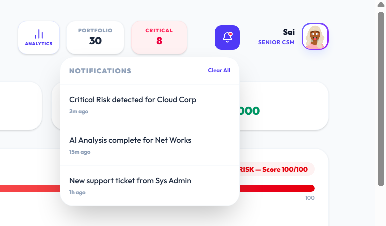

### Admin Dashboard — Outcome Summary
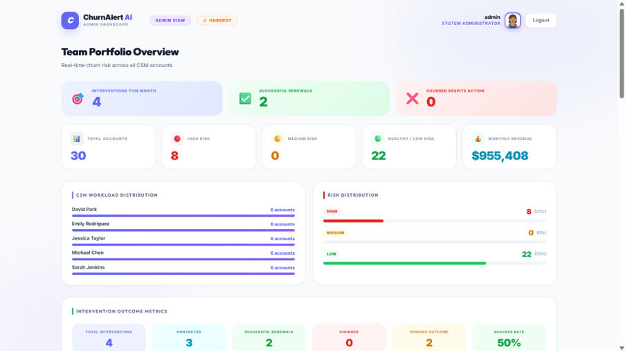

### Risk Engine Configuration
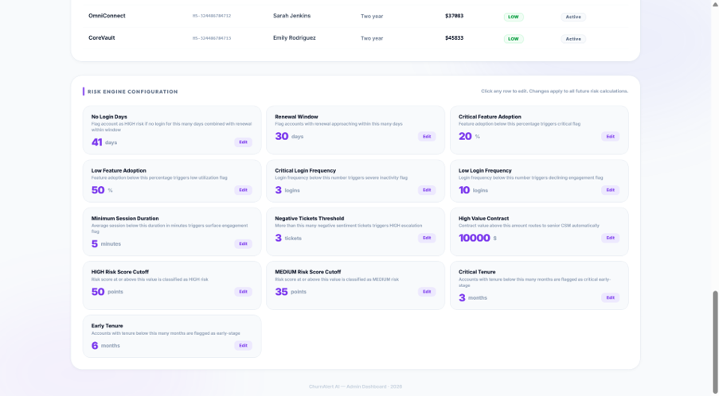

### Analytics Page — All 4 Charts
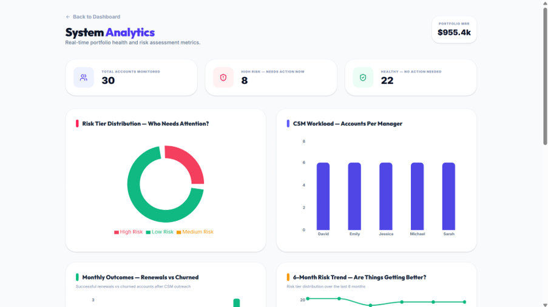


### ChromaDB — 1869 Kaggle IBM Telco Records
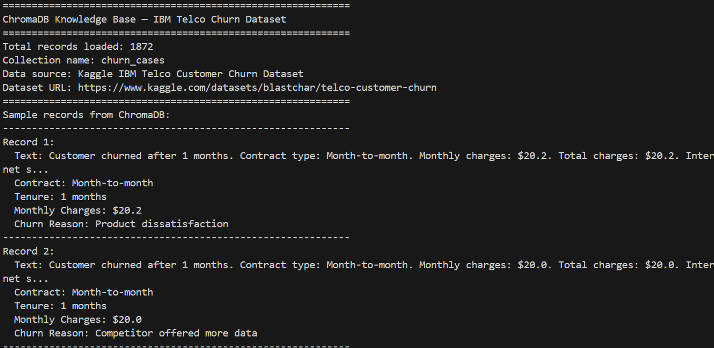

### LangGraph Checkpointing — SQLite Verification
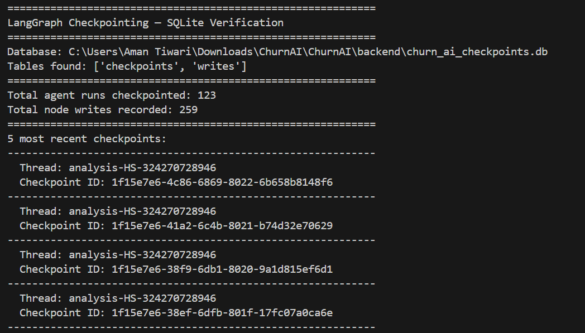

### APScheduler — 6am and 6:30am Jobs
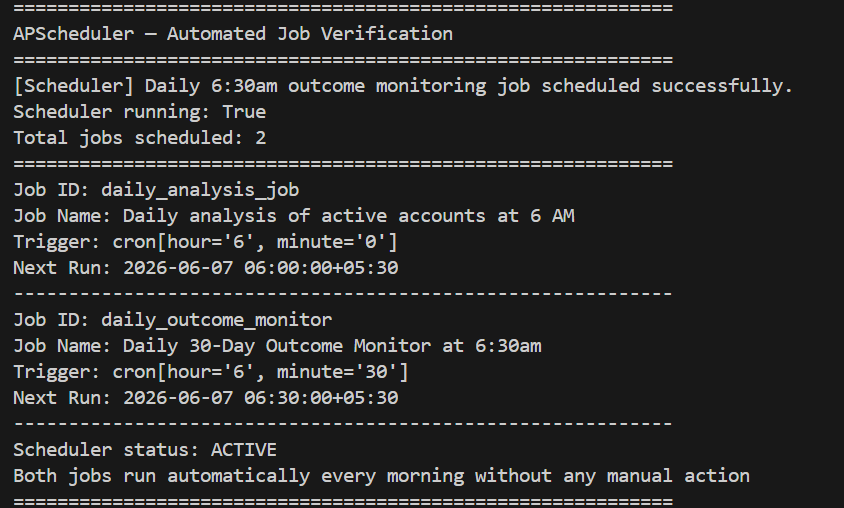

### Backend Running — Scheduler Confirmed
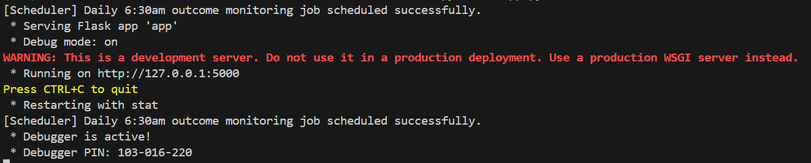

</details>

---

## Features

- **HubSpot MCP Integration** — Live CRM data from real HubSpot companies via Service Key
- **Dual Data Source** — Switch between HubSpot live data and CSV demo data from the dashboard
- **6-Node LangGraph Agent** — Monitor → Score → Reason → Brief → Human Review → Outcome
- **Deterministic Rules Engine** — 13 configurable thresholds editable by Admin in real time
- **ChromaDB RAG** — 1,869 real churn cases from IBM Telco Kaggle dataset power Similar Past Accounts
- **LangSmith Observability** — Every AI decision recorded and auditable
- **APScheduler** — Automated 6am daily analysis and 6:30am 30-day outcome monitoring
- **LangGraph Checkpointing** — Agent memory persists across server restarts via SQLite
- **Role-Based Auth** — CSM (User) and Admin roles with email-based registration lock
- **Node 6 Closed Loop** — Mark as Renewed saves success case to ChromaDB. Mark as Churned adjusts rule weights and flags for Admin
- **HubSpot Note Logging** — Approved outreach messages automatically logged to HubSpot company timeline
- **Admin Threshold Config** — Change rules engine thresholds live — effect visible immediately on dashboard
- **Intervention Outcome Tracking** — Success rate, renewals, churned accounts tracked per data source
- **Chatbot** — AI assistant with suggested questions and bullet-point responses

---

## Project Structure

```
ChurnAlert AI/
├── README.md
├── Screenshots/                        # All UI and terminal screenshots
│
├── backend/                            # Flask Python backend
│   ├── app.py                          # Main Flask app — 22 REST endpoints
│   ├── agent.py                        # LangGraph 6-node StateGraph
│   ├── rules_engine.py                 # Deterministic risk scoring engine
│   ├── mcp_client.py                   # HubSpot MCP integration
│   ├── rag.py                          # ChromaDB RAG — similar past accounts
│   ├── data_loader.py                  # CSV and database data loading
│   ├── models.py                       # SQLAlchemy ORM models
│   ├── database.py                     # SQLite database setup
│   ├── feedback_loop.py                # Rule weight recalibration
│   ├── seed_data.py                    # Seed accounts and usage data
│   ├── seed_rag.py                     # Load Kaggle IBM Telco data into ChromaDB
│   ├── seed_thresholds.py              # Seed 13 default rule thresholds
│   ├── llm.py                          # LLM initialization — Groq Llama 3.1
│   ├── migrate.py                      # Database migration script
│   ├── generate_csv.py                 # Generate synthetic CSV accounts
│   ├── IBM_kaggle_chromadb.py          # Verify ChromaDB Kaggle records
│   ├── langraph_checkpoints_verify.py  # Verify LangGraph checkpointing
│   ├── apscheduler_verify.py           # Verify APScheduler jobs
│   ├── create_hubspot_properties.py    # Create HubSpot custom properties via API
│   ├── create_hubspot_tickets.py       # Create HubSpot tickets for HIGH risk companies
│   ├── .env.example                    # Environment variables template
│   ├── requirements_updated.txt        # Python dependencies
│   ├── chroma_db/                      # ChromaDB persistent storage
│   └── data/
│       ├── accounts.csv                # CSV demo accounts
│       ├── metrics.csv                 # Usage metrics data
│       └── tickets.csv                 # Support tickets data
│
└── frontend/                           # React Vite frontend
    ├── src/
    │   ├── pages/
    │   │   ├── LandingPage.jsx         # Landing page
    │   │   ├── Login.jsx               # Login with role selector
    │   │   ├── Signup.jsx              # Signup with role lock
    │   │   ├── Dashboard.jsx           # CSM dashboard — main screen
    │   │   ├── AdminDashboard.jsx      # Admin team-wide view
    │   │   └── Analytics.jsx           # Analytics — 4 charts
    │   └── components/
    │       └── Chatbot.jsx             # Floating chatbot component
    ├── package.json
    └── vite.config.js
```

---

## Architecture

```
CSM logs in
    ↓
Data Source Selector — HubSpot CRM or CSV Demo
    ↓
Account List — sorted HIGH → MEDIUM → LOW
    ↓
Click Account → Risk Factor Breakdown
    ↓
Trigger Analysis → LangGraph 6-Node Agent
    ↓
NODE 1 — MONITOR
HubSpot MCP pulls account data — last login, feature usage, support tickets, renewal date
    ↓
NODE 2 — SCORE
Deterministic rules engine — 13 configurable thresholds — outputs HIGH / MEDIUM / LOW
    ↓
NODE 3 — REASON
Groq Llama 3.1 reads signals + top 3 ChromaDB similar cases
Produces 3-bullet reasoning, confidence level, action plan, outreach draft
LangSmith records every step
    ↓
NODE 4 — BRIEF
Packages action brief — routes to CSM queue sorted by urgency
    ↓
NODE 5 — HUMAN REVIEW
CSM reads, edits, clicks Approve & Deploy
Message logged to HubSpot timeline via MCP
    ↓
NODE 6 — OUTCOME
Mark as Renewed → saves success case to ChromaDB
Mark as Churned → adjusts rule weights, flags for Admin
30-day auto-monitoring via APScheduler at 6:30am
```

---

## Knowledge Base — Kaggle IBM Telco Dataset

The ChromaDB vector database is built from the **IBM Telco Customer Churn Dataset** sourced from Kaggle.

- **Dataset**: [IBM Telco Customer Churn](https://www.kaggle.com/datasets/blastchar/telco-customer-churn)
- **Records loaded**: 1,869 churned customer cases
- **Purpose**: Powers the Similar Past Accounts RAG feature — when the AI analyzes an at-risk account it retrieves the top 3 most similar historical churn cases from this dataset
- **Fields used**: Contract type, tenure, monthly charges, churn reason, internet service type
- **Embedding model**: ChromaDB DefaultEmbeddingFunction (ONNX)

This is NOT synthetic or Faker-generated data. The 1,869 cases are real historical churn records that the AI uses to reason about intervention strategies.

To verify ChromaDB records:
```bash
python backend/IBM_kaggle_chromadb.py
```

---

## Tech Stack

| Layer | Technology |
|-------|-----------|
| Frontend | React, Vite, Tailwind CSS |
| Backend | Flask (Python), 22 REST endpoints |
| Database | SQLite with SQLAlchemy ORM |
| Agent Orchestration | LangGraph StateGraph with SQLite checkpointing |
| LLM | Groq with Llama 3.1-8b-instant |
| MCP | HubSpot MCP via Service Key |
| Vector DB | ChromaDB with DefaultEmbeddingFunction (ONNX) |
| RAG | ChromaDB — top 3 similar past cases per account |
| Observability | LangSmith — traces every agent node |
| Scheduler | APScheduler — 6am daily analysis, 6:30am outcome monitor |

---

## Prerequisites

- Python 3.10+
- Node.js 18+
- HubSpot Developer Account (free)
- Groq API Key (free at console.groq.com)
- LangSmith API Key (free at smith.langchain.com)

---

## Installation & Running

### 1. Clone the repository

```bash
git clone https://github.com/SaiShruthiSridhar/ChurnAlert-AI.git
cd ChurnAlert-AI
```

### 2. Backend Setup

```bash
cd backend
python -m venv env

# Windows
env\Scripts\activate

# Mac/Linux
source env/bin/activate

pip install -r requirements_updated.txt
```

### 3. Environment Variables

Copy the example file and fill in your keys:

```bash
cp backend/.env.example backend/.env
```

Edit `backend/.env` with your actual keys:

```env
GROQ_API_KEY=your_groq_api_key
LANGCHAIN_TRACING_V2=true
LANGCHAIN_API_KEY=your_langsmith_api_key
LANGCHAIN_PROJECT=churneye
HUBSPOT_CLIENT_ID=your_hubspot_client_id
HUBSPOT_CLIENT_SECRET=your_hubspot_client_secret
HUBSPOT_REDIRECT_URI=http://localhost:5000/hubspot/callback
HUBSPOT_APP_ID=your_hubspot_app_id
HUBSPOT_ACCESS_TOKEN=your_hubspot_service_key
HUBSPOT_REFRESH_TOKEN=
```

### 4. Initialize Database and Seed Data

```bash
cd backend
python seed_data.py
python seed_thresholds.py
python seed_rag.py
```

### 5. Start Backend

```bash
cd backend
python app.py
```

Backend runs at: `http://localhost:5000`

### 6. Frontend Setup

```bash
cd frontend
npm install
npm run dev
```

Frontend runs at: `http://localhost:5173`

---

## HubSpot Setup (Optional — for live CRM data)

1. Go to [developers.hubspot.com](https://developers.hubspot.com) and create a free developer account
2. Create a Test Account
3. Go to Settings → Integrations → Service Keys → Create
4. Add scopes: `crm.objects.companies.read`, `crm.objects.contacts.read`, `tickets`, `crm.schemas.companies.write`
5. Copy the Service Key token into `HUBSPOT_ACCESS_TOKEN` in `.env`
6. Run `python create_hubspot_properties.py` to create custom properties
7. Import your companies CSV into HubSpot

---

## Verification Scripts

```bash
# Verify ChromaDB has 1869 Kaggle records
python backend/IBM_kaggle_chromadb.py

# Verify LangGraph checkpointing is active
python backend/langraph_checkpoints_verify.py

# Verify APScheduler jobs are configured
python backend/apscheduler_verify.py
```

---

## API Endpoints

| Method | Endpoint | Description |
|--------|----------|-------------|
| GET | /accounts | Get all accounts (source=hubspot or csv) |
| GET | /accounts/\<id\> | Get account details |
| POST | /analyze/\<id\> | Run AI analysis on account |
| POST | /accounts/\<id\>/approve | Approve outreach — logs to HubSpot |
| POST | /accounts/\<id\>/renew | Mark account as renewed |
| POST | /accounts/\<id\>/outcome | Record churn outcome |
| GET | /accounts/\<id\>/similar | Get similar past cases from ChromaDB |
| GET | /analytics | Portfolio analytics |
| GET | /analytics/outcomes | Intervention outcome metrics |
| GET | /analytics/trends | 6-month risk trend data |
| GET | /analytics/ai-insights | AI executive summary |
| POST | /chat | Chatbot response |
| GET | /hubspot/status | HubSpot connection status |
| GET | /admin/thresholds | Get all 13 rule thresholds |
| PUT | /admin/thresholds/\<rule\> | Update a threshold |
| POST | /auth/signup | Register new user |
| POST | /auth/login | Login with role verification |

---

## Contributing

1. Fork the repository
2. Create a feature branch (`git checkout -b feature/AmazingFeature`)
3. Commit your changes (`git commit -m 'Add some AmazingFeature'`)
4. Push to the branch (`git push origin feature/AmazingFeature`)
5. Open a Pull Request

---

## Technologies

- **Frontend**: React, Vite, Tailwind CSS, Recharts, Framer Motion, Lucide React
- **Backend**: Python 3, Flask, Flask-CORS, SQLAlchemy
- **AI/ML**: LangGraph, LangChain, Groq (Llama 3.1), LangSmith
- **Vector DB**: ChromaDB, ONNX Embeddings
- **MCP**: HubSpot MCP via Service Key
- **Database**: SQLite
- **Scheduler**: APScheduler
- **Data**: IBM Telco Customer Churn Dataset (Kaggle), Faker (synthetic demo data)

---

© 2026 ChurnAlert AI. Built for the future of SaaS customer retention.
